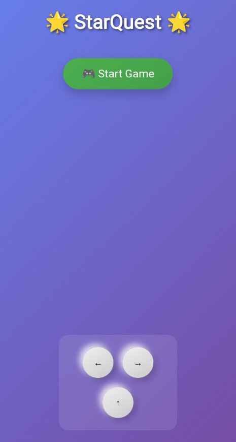
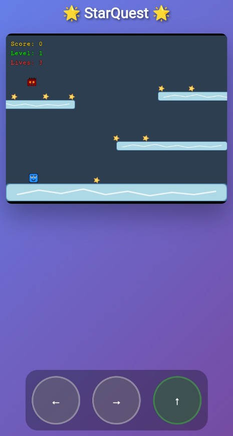
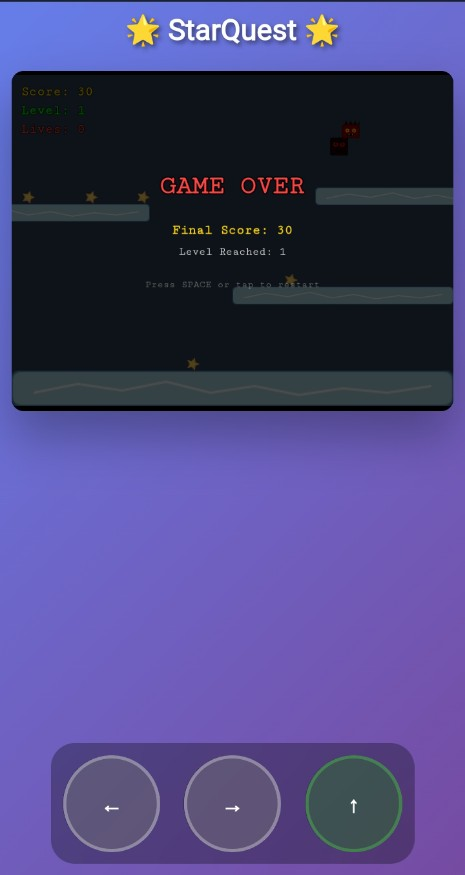

# 🌟 StarQuest ❄️

**StarQuest** adalah game platformer 2D bertema luar angkasa es, di mana kamu mengendalikan karakter lucu untuk mengumpulkan bintang dan menghindari musuh. Uji ketangkasanmu untuk mencapai skor dan level tertinggi!

🎮 **Mainkan sekarang:** [https://sammdodev.github.io/StarQuest/](https://sammdodev.github.io/StarQuest/)

---

## 🧊 Tangkapan Layar

| Start Menu | Gameplay | Game Over |
|------------|----------|-----------|
|  |  |  |

---

## ❄️ Fitur

- ❄️ Tema es yang menawan dan lembut
- 🌠 Kumpulkan bintang untuk mendapat skor
- 👾 Hindari musuh menyeramkan
- 📱 Kontrol layar sentuh (kiri, kanan, lompat) yang intuitif
- 🔁 Level meningkat secara progresif

---

## 🎮 Cara Bermain

- Gunakan tombol:
  - ⬅️ untuk bergerak ke kiri
  - ➡️ untuk bergerak ke kanan
  - ⬆️ untuk melompat
- Kumpulkan semua ⭐ bintang
- Hindari musuh 🔥 untuk tetap hidup
- Jika nyawa (Lives) habis, game over

---

## 🔗 Link

- 🌐 [Mainkan Game](https://sammdodev.github.io/StarQuest/)
- 💼 Developer: [sammdodev](https://github.com/sammdodev)

---

## 📁 Struktur Folder

/
├── index.html
├── js/
│ └── game.js
├── assets/
│ ├── images/
│ └── screenshots/
│ ├── start.jpg
│ ├── gameplay.jpg
│ └── gameover.jpg

---

## 📜 Lisensi

Game ini dibuat untuk pembelajaran dan hiburan. Silakan gunakan dan modifikasi dengan bebas untuk keperluan non-komersial.
