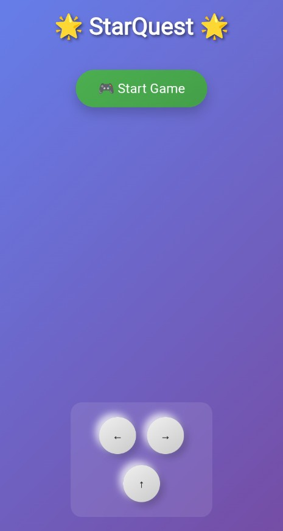
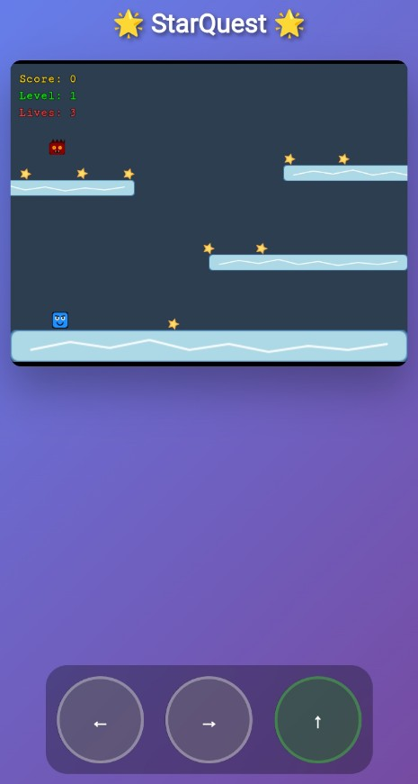
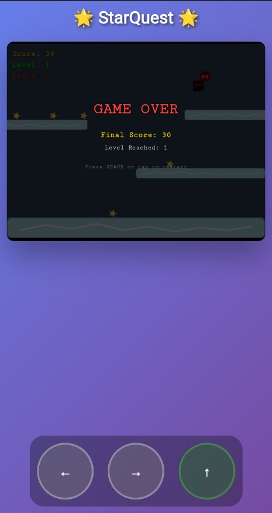

# ✨ StarQuest - Ambil Bintang, Hindari Musuh!

**StarQuest** adalah game sederhana buatan **Samdo Dev** menggunakan **Phaser 3**.  
Pemain mengontrol **karakter manusia** untuk **mengambil bintang** sebanyak mungkin dan **menghindari musuh** yang datang dari mana saja.

🎮 **Mainkan sekarang:**  
👉 [https://sammdodev.github.io/StarQuest/](https://sammdodev.github.io/StarQuest/)

---

## 🖼️ Cuplikan Layar

<table>
  <tr>
    <td align="center">
      <b>Menu Awal</b> 
      
    </td>
    <td align="center">
      <b>Gameplay</b> 
      
    </td>
    <td align="center">
      <b>Game Over</b> 
      
    </td>
  </tr>
</table>

---

## 🎮 Cara Main

- Tekan tombol panah **Kanan (⭢)** untuk bergerak ke kanan  
- Tekan tombol panah **Kiri (⭠)** untuk bergerak ke kiri  
- Tekan tombol **Atas (⭡)** untuk melompat  
- Ambil sebanyak mungkin **bintang** ✨  
- Hindari **musuh** 👾 yang bergerak dari mana saja  
- Jika tertabrak musuh → **Game Over**

---

## 🛠️ Teknologi

- [Phaser 3](https://phaser.io/phaser3)  
- HTML5 + JavaScript  
- VS Code

---

## 📜 Lisensi

Game ini dikembangkan untuk tujuan pembelajaran. Bebas digunakan dan dimodifikasi dengan menyertakan kredit ke **Samdo Dev**.

---
